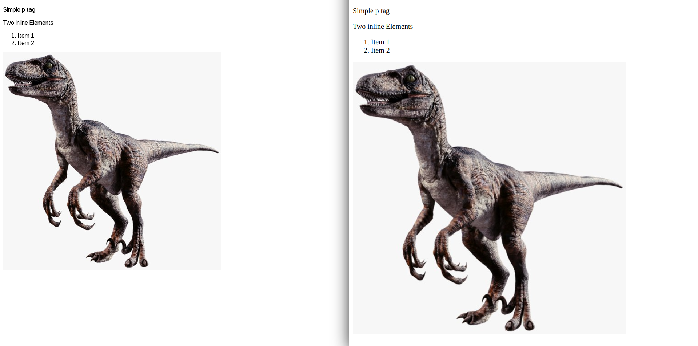

# Raptor

Just a simple browser, developed for learning purposes.

## Requirements
* SFML 2.5.1

## How to build
Create build directory to store binaries and build files and enter it:
```bash
mkdir build
cd build
```

Run _cmake_ to configure the project and create binaries with make:
```bash
cmake .. && make
```

If you want to use _ninja_ instead of _make_:
```bash
cmake .. -GNinja && ninja
```

Finally, run the raptor program, with an optional parameter to open a .html file:
```bash
./raptor <path_to_file>
```

## Screenshots
_raptor (left) vs. brave(right)_



